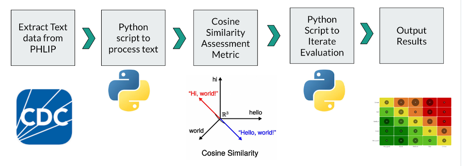
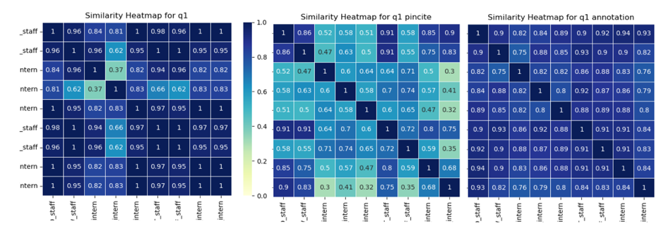
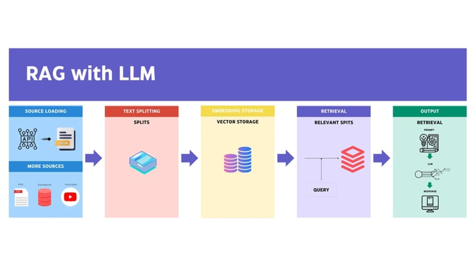
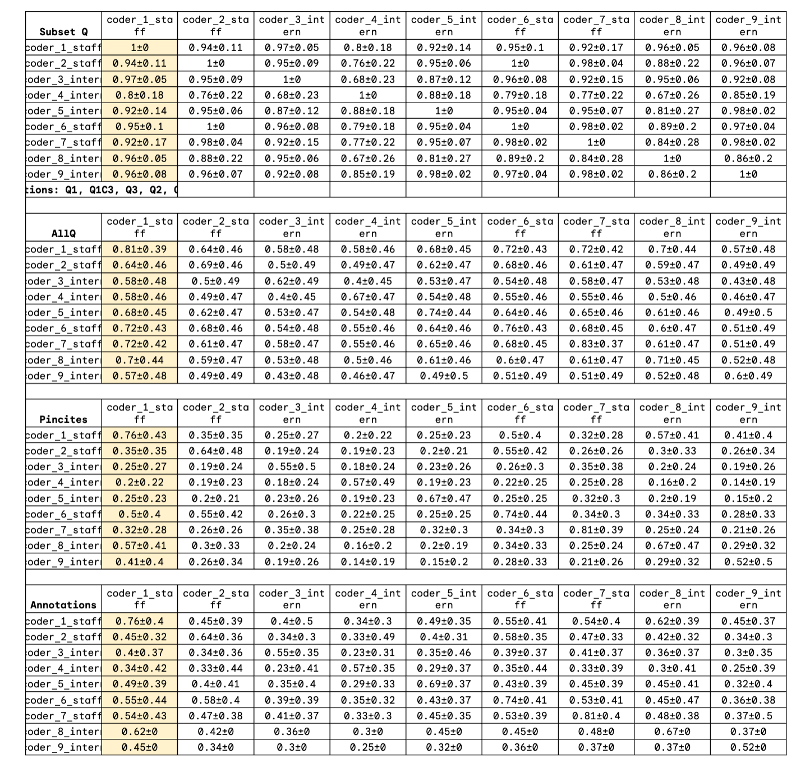

# RAG_Legal_Epi
Automated Methods to Improve Legal Coding Assessment

# Table of Contents

File | Description
-------|--------
RAG_Automated_Answers_byState.py | Code for Retrieval Augmented Generation (RAG) system to intake a set of questions, and read through a database and provide output answers
RAG_Questions | Question Intake for RAG system
Similarity_Assessment.py | Code for similarity assessment between 2 text files 
CDC_PHLF_Presentation_Raj.pdf | Project Overview 
Coder_Data | Folder containing results from both human legal coder similarity assessment against other human coders
RAG_Data | Folder containing results from RAG outputs, and similarity assessments against other validated human responses 
Images | Figures used in project

# Project Overview
Background:
The increasing complexity and volume of legal texts in public health policy require
innovative solutions to improve similarity and consistency in legal coding. This study
examines the consistency of manual legal coding approaches and compares them with
computational methods to identify opportunities for automation in legal epidemiology.
The primary aim is to assess the reliability of automated coding techniques against
human-validated coding.

Methods:
The study employs a dual-method approach addressing two research questions: (1) the
consistency of manual coding across human coders, and (2) the alignment between
human and computational coding outcomes. Text data from Public Health Law
Implementation Projects (PHLIP) were processed using Python scripts to evaluate
coder consistency using metrics such as interrater reliability, and cosine similarity. For
computational methods, automated scripts leveraging cosine similarity and retrieval
augmented generation (RAG) models were developed to replicate and validate manual
coding processes. Text masking was applied to mitigate template-based biases.

Results:
Initial findings highlight substantial agreement among human coders for subsets of
questions, particularly binary-coded items, particularly for certain roles. Computational
methods achieved comparable reliability scores, with specific gains in replicability and
scalability. Challenges included managing data privacy, adapting to legal language
nuances, and accounting for data gaps.

Conclusions:
Automated legal coding methods demonstrate potential for enhancing efficiency and
consistency in legal epidemiology. The study underlines the feasibility of applying NLP-
based methods to public health law assessments, paving the way for broader
integration of automated tools in legal and health policy analyses. Future work will refine
these models, expand their application to diverse legal texts, and develop robust
frameworks to assess the relevance and accuracy of legal coding systems.

# Research Aims

How do automated computational methods of legal coding compare to manual legal coding:
What is the observed consistency across all human validated coding approaches ? What areas are consistent, and where are the highest variances observed?
What level of consistency is observed between the answers validated by humans versus computational methods?
  * Compare computational answers to human answer choices: Do both humans and computer choices gravitate towards a common document choice?
  * Are computational approaches better at conducting legal coding for some questions versus others?

# Methods Setup 

To setup the human legal coder evaluation against all other human legal coders, cosine similarity metric was utilized. Additionally columns that are the same in each coder’s data will be hidden from evaluation via masking as to not artificially increase the similarity scoring. Legal coder data will be split the comparison by evaluating all coders by question and each question’s associated pincite (legal citation format) and annotation. This provides insight into the similarity of answers and variance for those answers by question, and also allows gauging of answer consensus across all coders.

Interpreting outputs: The resulting output is a heatmap for each question, pincite associated with each question, and annotation associated with each question, evaluated against all coders.  

Diagonal (Perfect Similarity):
The diagonal of the heatmap compares each dataframe to itself, so each cell on the diagonal will have a value of 1 (since a dataframe is always 100% similar to itself).
These values are typically shown as the darkest points, depending on the color map.

Off-Diagonal Values (Pairwise Similarity):
The off-diagonal cells represent the pairwise cosine similarity between different dataframes.
Higher similarity (values close to 1) between two dataframes means that the contents of the two dataframes are very similar. This would appear as brighter areas in the heatmap.
Lower similarity (values close to 0) means the two dataframes share few common elements. These areas will appear as darker spots on the heatmaps

For the Retreival Augmented Generation (RAG) LLM system setup, a few considerations were applied to ensure open source access, and privacy. The following tools were used: Ollama, LLM model - mistral     f974a74358d6    4.1 GB

The system was setup such that the RAG system only used state level policy files to answer a set of questions (see RAG_Data/questions_RAG.csv) and provide an output in a specified format (see RAG python code, and template output file RAG_Data/Medicolegal-Death-Investigation-(MLDI)-Phase-I-RAG_Answers.csv). The output of the RAG answers were then compared to the validated consensus answer file from the human legal coders to assess similarity. 

Image Source: Source: “Build Your Own RAG App: A Step-by-Step Guide to Setup LLM locally using Ollama, Python, and ChromaDB”, Dev.https://github.com/user-attachments/assets/373b0b9d-ba23-44e9-b891-96eb6cac2da1 

# Findings

* Legal Coder Intra-Similarity Evaluation

   Due to many data gaps in the coder texts, similarity scores had a high degree of variability between the questions, pincites, annotations. However some trends were apparent in that binary questions (yes/no) had a high degree of consistency, and staff showed more consistency with each other compared to intern roles. 
  
   
* Validated Legal Coder Responses vs. RAG Automated Responses:
    Suprisingly many of the similarity evaluations for the RAG vs. Validated answers even the binary responses were low, whereas many of the response annotation scores were on par with the human intra-similairty scores (0.5-0.7). It is possible this is because the RAG system even with specific instructions for Yes/No answers were wordy responses compared to the human responses which adhered to the answer choices for a given question. On the annotation side, the data was not pre-processed to remove filler and stop words so the general language semantics could have increased the similarity evaluations. It is interesting to see high degree of overlap in answer values between the RAG system and the legal coders. In this specific scenario, the citations were not evaluated for accuracy but could be a future avenue to look into. 

# References

1. Alice, E., Witt., Anna, Huggins., Guido, Governatori., Joshua, Buckley. Encoding
legislation: a methodology for enhancing technical validation, legal alignment and
interdisciplinarity. Artificial Intelligence and Law, (2023). doi: 10.1007/s10506-
023-09350-1
   
2. Van Rijsbergen, C. (1979, September). Information retrieval: theory and practice.
In Proceedings of the joint IBM/University of Newcastle upon tyne seminar on
data base systems (Vol. 79, pp. 1-14).

3. Leila, Martini., David, Presley., Sarah, Klieger., Scott, Burris. (2015). Scan of
CDC Legal Epidemiology Articles, 2011-2015. Social Science Research Network,
doi: 10.2139/SSRN.2683585

4. Citation Format: https://www.legalbluebook.com/ 

